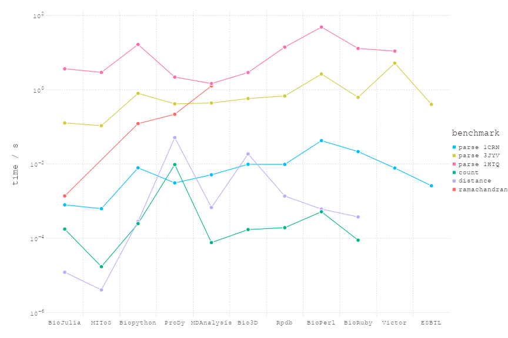

# PDB benchmarks

Open source software packages to parse [Protein Data Bank](http://www.rcsb.org/pdb/home/home.do) (PDB) files and manipulate protein structures exist in many languages, often as part of Bio* projects.

This repository aims to collate benchmarks for common tasks across various languages and packages. The collection of scripts may also be useful to get an idea how each package works.

Please feel free to contribute scripts from other packages, or submit improvements to the scripts already present - I'm looking for the fastest implementation for each software that makes use of the provided API.

Disclosure: I contributed the BioStructures.jl package to BioJulia and have made contributions to Biopython.

## Tests

* Parsing 3 PDB files, taken from the benchmarking in [1]:
  * [1CRN](http://www.rcsb.org/pdb/explore/explore.do?structureId=1crn) - hydrophobic protein (327 atoms)
  * [3JYV](http://www.rcsb.org/pdb/explore/explore.do?structureId=3jyv) - 80S rRNA (57,327 atoms)
  * [1HTQ](http://www.rcsb.org/pdb/explore/explore.do?structureId=1htq) - multicopy glutamine synthetase (10 models of 97,872 atoms)
* Counting the number of alanine residues in adenylate kinase ([1AKE](http://www.rcsb.org/pdb/explore/explore.do?structureId=1ake))
* Calculating the distance between residues 50 and 60 of chain A in adenylate kinase ([1AKE](http://www.rcsb.org/pdb/explore/explore.do?structureId=1ake))
* Calculating the Ramachandran phi/psi angles in adenylate kinase ([1AKE](http://www.rcsb.org/pdb/explore/explore.do?structureId=1ake))

[1] Gajda MJ, hPDB - Haskell library for processing atomic biomolecular structures in protein data bank format, *BMC Research Notes* 2013, **6**:483 | [link](http://bmcresnotes.biomedcentral.com/articles/10.1186/1756-0500-6-483)

The PDB files can be downloaded to directory `pdbs` by running `source tools/download_pdbs.sh` from this directory. If you have all the software installed, and compiled where applicable, you can use the script `tools/run_benchmarks.sh` from this directory to run the benchmarks. The mean over a number of runs is taken for each benchmark to obtain the values below.

Benchmarks were carried out on an Intel Xeon CPU E5-1620 v3 3.50GHz x 8 processor with 32 GB 2400 MHz DDR4 RAM. The operating system was CentOS v7.4.1708. Time is the elapsed time.

## Software

* [BioJulia](https://github.com/BioJulia/BioStructures.jl) v0.6.0 running on Julia v1.1.0 (times measured after JIT compilation)
* [MIToS](https://github.com/diegozea/MIToS.jl) v2.4.0 running on Julia v1.1.0 (times measured after JIT compilation)
* [Biopython](http://biopython.org/wiki/Biopython) v1.74 running on Python v3.7.3
* [ProDy](http://prody.csb.pitt.edu/) v1.10.10 running on Python v3.7.3
* [MDAnalysis](http://www.mdanalysis.org/) v0.20.1 running on Python v3.7.3
* [Bio3D](http://thegrantlab.org/bio3d/index.php) v2.3-4 running on R v3.5.0
* [Rpdb](https://cran.r-project.org/web/packages/Rpdb/index.html) v2.3 running on R v3.5.0
* [BioPerl](http://bioperl.org/index.html) v1.007002 running on Perl v5.16.3
* [BioRuby](http://bioruby.org/) v1.5.1 running on Ruby v2.0.0
* [Victor](http://protein.bio.unipd.it/victor/index.php/Main_Page) v1.0 compiled with g++ v7.3.1
* [ESBTL](http://esbtl.sourceforge.net/index.html) v1.0-beta01 compiled with g++ v7.3.1

## Comparison

Note that direct comparison between these times should be treated with caution, as each package does something slightly different. For example, things that increase parsing time include:

* Parsing the PDB header
* Accounting for disorder at both the atom and residue (point mutation) level
* Forming a heirarchical model of the protein that makes access to specific residues, atoms etc. easier and faster after parsing
* Checking that the PDB format is adhered to at various levels of strictness

Each package supports these to varying degrees.

|                       | BioJulia     | MIToS        | Biopython    | ProDy        | MDAnalysis   | Bio3D        | Rpdb         | BioPerl       | BioRuby      | Victor        | ESBTL        |
| :-------------------- | :----------- | :----------- | :----------- | :----------- | :----------- | :----------- | :----------- | :------------ | :----------- | :------------ | :----------- |
| Parse 1CRN / ms       | 1.3          | 1.9          | 8.0          | 4.2          | 7.4          | 13           | 12           | 72            | 49           | 35            | 4.5          |
| Parse 3JYV / s        | 0.42         | 0.39         | 1.1          | 0.47         | 0.54         | 0.85         | 1.3          | 3.8           | 1.4          | 9.9           | 0.65         |
| Parse 1HTQ / s        | 5.5          | 17           | 24           | 2.0          | 2.2          | 4.5          | 22           | 81            | 23           | 25            | -            |
| Count / ms            | 0.74         | 0.078        | 0.52         | 14           | 0.15         | 0.23         | 0.28         | 1.2           | 0.23         | -             | -            |
| Distance / ms         | 0.068        | 0.010        | 0.54         | 72           | 1.1          | 26           | 1.6          | 1.3           | 1.9          | -             | -            |
| Ramachandran / ms     | 6.9          | -            | 150          | 330          | 2000         | -            | -            | -             | -            | -             | -            |
| Language              | Julia        | Julia        | Python       | Python       | Python       | R            | R            | Perl          | Ruby         | C++           | C++          |
| Parses header         | ✗            | ✗            | ✓            | ✓            | ✗            | ✓            | ✓            | ✗             | ✓            | ✓             | ✗            |
| Hierarchichal parsing | ✓            | ✗            | ✓            | ✓            | ✓            | ✗            | ✗            | ✓             | ✓            | ✓             | ✓            |
| Supports disorder     | ✓            | ✗            | ✓            | ✗            | ✗            | ✗            | ✗            | ✗             | ✗            | ✗             | ✓            |
| Writes PDBs           | ✓            | ✓            | ✓            | ✓            | ✓            | ✓            | ✓            | ✓             | ✗            | ✓             | ✓            |
| Superimposition       | ✗            | ✓            | ✓            | ✓            | ✓            | ✓            | ✗            | ✗             | ✗            | ✗             | ✗            |
| PCA                   | ✗            | ✗            | ✗            | ✓            | ✓            | ✓            | ✗            | ✗             | ✗            | ✗             | ✗            |
| License               | MIT          | MIT          | Biopython    | MIT          | GPLv2        | GPLv2        | GPL          | GPL/Artistic  | Ruby         | GPLv3         | GPLv3        |

Benchmarks as a plot:

## Parsing the whole PDB

It is instructive to run parsers over the whole PDB to see where errors arise. This approach has led to me submitting corrections for small mistakes (e.g. duplicate atoms, residue number errors) in a few PDB structures. As of July 2018, the PDB entries that error with the Biopython (permissive mode) and BioJulia parsers are:
* 4UDF - mmCIF file errors in Biopython and BioJulia due to duplicate C and O atoms in Lys91 of chains B, F etc.
* 1EJG - mmCIF file errors in Biopython due to blank and non-blank alt loc IDs at residue Pro22/Ser22.
* 5O61 - mmCIF file errors in Biopython due to an incorrect residue number at line 165,223.

Running Biopython in non-permissive mode picks up more potential problems such as broken chains and mixed blank/non-blank alt loc IDs. For further discussion on errors in PDB files see the Biopython [documentation](http://biopython.org/DIST/docs/tutorial/Tutorial.pdf). The scripts to reproduce the whole PDB checking can be found in `checkwholepdb`. There is also a script to check recent PDB changes that can be run as a CRON job.

## Opinions

* For most purposes, particularly work on small numbers of files, the speed of the programs will not hold you back. In this case use the language/package you are most familiar with.
* If you are analysing ensembles of proteins use packages with that functionality, such as ProDy or Bio3D, rather than writing the code yourself.
* For fast parsing, consider using a binary format such as [MMTF](http://mmtf.rcsb.org/) or [binaryCIF](https://github.com/dsehnal/BinaryCIF).

## Contributing

If you want to contribute benchmarks for a package, please make a pull request with the script(s) in a directory like the other packages. I will run the benchmarks again and change the README, thanks.

## Plans

* Test BioJava, hPDB, possibly others.
* Add benchmarks for parsing mmCIF, the standard PDB archive format.
* Add benchmarks for parsing binary formats, e.g. MMTF.

## Resources

* Benchmarks for mmCIF parsing can be found [here](https://github.com/project-gemmi/mmcif-benchmark).
* The PDB file format documentation can be found [here](http://www.wwpdb.org/documentation/file-format).
* A list of PDB parsing packages, particularly in C/C++, can be found [here](http://bioinf.org.uk/software/bioplib/libraries/).
* The Biopython [documentation](http://biopython.org/DIST/docs/tutorial/Tutorial.pdf) has a useful discussion on disorder at the atom and residue level.
* Sets of utility scripts exist including [pdbtools](https://github.com/harmslab/pdbtools), [pdb-tools](https://github.com/JoaoRodrigues/pdb-tools) and [PDBFixer](https://github.com/pandegroup/pdbfixer).
