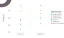

# PDB benchmarks

**Warning: under development. Don't trust these benchmarks yet.**

Open source software to parse [Protein Data Bank](http://www.rcsb.org/pdb/home/home.do) (PDB) files and manipulate protein structures exist in many languages, usually as part of Bio* projects.

This repository aims to collate benchmarks for common tasks across various languages.

Please feel free to contribute scripts from other languages, or improve the scripts already present - I'm looking for the fastest implementation for each software that makes use of the provided API.

Disclosure: I contributed the `Bio.Structure` module to BioJulia.

## Tests

* Parsing 3 PDB files, as in...:
  -
  -
  -
* Counting the number of alanine residues in...
* Calculating the distance between residues . and . in ...
* Calculating the Ramachandran phi/psi angles in...

## Software

* BioJulia - v... (times measured after JIT compilation)
* Biopython (numpy?)
Also information on the language versions

## Comparison

Mac OS X Yosemite 10.10.5
3.1 GHz Intel Core i7
16 GB 1867 MHz DDR3

Time measured is time to completion, so CPU...

All times in seconds.

| Software    | Parse 1CRN | Parse 3JYV | Parse 1HTQ | Count   | Distance  | Ramachandran |
| :---------- | :--------- | :--------- | :--------- | :------ | :-------- | :----------- |
| BioJulia    | 0.0030     | 0.68       | 22         | 0.00017 | 0.0000052 | 0.0017       |
| Biopython   | 0.0086     | 1.3        | 24         | 0.00024 | 0.00028   | 0.16         |

# Parsing errors

I plan to run the packages on the whole PDB and record any errors.
